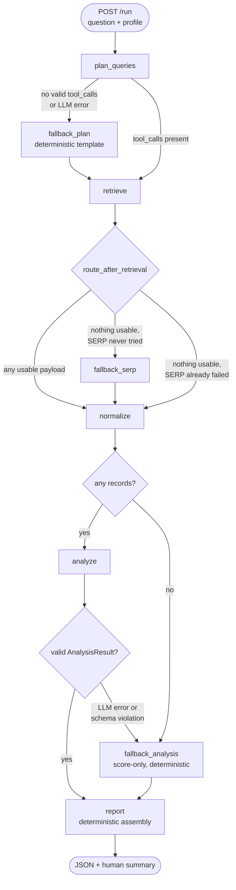

# Agentic Search Intelligence System

A LangGraph DAG that turns a natural-language search-visibility question into a scored,
persisted report. The graph plans which DataForSEO calls to make (real LLM tool-calling),
executes them behind a validation gate, normalizes the responses, scores the opportunity,
synthesizes findings, and serves the whole thing over a REST API.

**It runs with no API keys.** DataForSEO is served from response fixtures and the LLM falls
back to a deterministic model that implements `bind_tools()`, so every path below — including
retries, degradation and both fallbacks — is reproducible offline.

---

## Quick start

```bash
make install          # venv (python 3.12) + pinned deps
make test             # 95 tests, offline, ~0.5s
make demo             # healthy run, retry-then-recover, total outage
                      #   -> demo-output.json  full reports, metrics, errors
                      #   -> demo-logs.ndjson  the structured log stream
                      #   -> demo-report.html  visual console, opens in your browser
                      #   --no-open writes the files without launching a browser
make report           # rebuild the report from demo-output.json and open it
make run              # http://127.0.0.1:8000/docs
make walkthrough      # drives the live API end to end (needs `make run` running)
```

`walkthrough.py` takes every input as a flag, so it is the quickest way to point the
system at a different brand:

```bash
./walkthrough.py --name Linear --domain linear.app --industry "issue tracking" \
  --question "Where do we rank for bug tracking software?" --min-score 0.3
./walkthrough.py --profile <uuid> --question "..."   # reuse a profile
./walkthrough.py --recheck --curl                    # + recheck, print the curl equivalents
```

```bash
# create a profile
curl -sX POST localhost:8000/api/v1/profiles -H 'content-type: application/json' -d '{
  "name": "Acme", "domain": "acme.io", "industry": "project management",
  "competitors": ["asana.com", "monday.com"]}'

# ask it a question
curl -sX POST localhost:8000/api/v1/profiles/<uuid>/run -H 'content-type: application/json' \
  -d '{"question": "Are we visible for agile planning tools?"}'
```

To use the real APIs: `cp .env.example .env`, set `MOCK_DATAFORSEO=false` with your
DataForSEO credentials, and/or set `OPENAI_API_KEY`. The two switches are independent —
a real LLM against mock data, or the reverse, both work.

---

## Architecture



Eight nodes, four conditional routers, three fallbacks, one deterministic terminal node.

### One responsibility per node

| Node | Does exactly this | LLM |
|---|---|---|
| `plan_queries` | Binds the three tools to the model and returns `AIMessage.tool_calls` | **yes** — `bind_tools` |
| `fallback_plan` | Templates tool calls from the question + brand name + industry | no |
| `retrieve` | Validates each tool call's args, executes it, returns raw payloads | **no LLM call** |
| `normalize` | Raw JSON → typed records, merged by `query_key` | no |
| `fallback_serp` | One minimal SERP call when SERP was never attempted | no |
| `analyze` | Deterministic scores + LLM rationale and recommendations | **yes**, Pydantic-validated |
| `fallback_analysis` | Score-only `AnalysisResult` when `analyze` fails | no |
| `report` | Formats the analysis into JSON + a prose summary | **no** |

No node both fetches and reasons. Synthesis exists only in `analyze`, so the terminal node
cannot fail on a model error, and `report` always receives a schema-valid `AnalysisResult`.

### Graph state

LangGraph **overwrites** ordinary keys and merges only reducer-annotated ones, so anything
several nodes contribute to carries an explicit reducer ([`app/graph/state.py`](app/graph/state.py)):

```python
raw_payloads: Annotated[list[RawPayload],    operator.add]
errors:       Annotated[list[PipelineError], operator.add]
node_events:  Annotated[list[NodeEvent],     operator.add]
```

---

## Tool calling

The planner uses real LangChain tool-calling; `retrieve` consumes the result without a
second model call.

```python
# plan_queries
bound = deps.llm.bind_tools(TOOLS)             # google_serp, keyword_metrics, chatgpt_response
message: AIMessage = bound.invoke([HumanMessage(content=prompt)])
return {"tool_calls": message.tool_calls}

# retrieve -- the validation gate
args = validate_args(call.name, call.args)     # Pydantic; raises ToolArgumentError
execution = client.execute(call.name, args)    # only now does anything leave the process
```

The model chooses *which* tool and *with what arguments*; the code re-validates every
argument before a paid call is made. A missing field, a wrong type, an out-of-range value or
a hallucinated field fails locally, lands in `errors[]`, and routes — it never crashes and
never costs money.

### The three tools

Organic results **and** the AI Overview block come back from the *same* advanced SERP
request, so a separate AI-Overview tool would duplicate a paid call.

| Tool | Endpoint | Timeout |
|---|---|---|
| `google_serp` | `POST /v3/serp/google/organic/live/advanced` | 20 s |
| `keyword_metrics` | `POST /v3/dataforseo_labs/google/keyword_overview/live` | 20 s |
| `chatgpt_response` | `POST /v3/ai_optimization/chat_gpt/llm_responses/live` | **130 s** |

Timeouts are per tool, not global: the ChatGPT live endpoint is documented at up to 120
seconds, so the 20 s default would time out on every single call.

Limits enforced in the Pydantic schemas, each verified against the docs:

- **`google_serp`** — `keyword` ≤ 700 chars; `depth` ≤ 200; `load_async_ai_overview`
  defaults to `false` because it costs an extra $0.002 per call.
- **`keyword_metrics`** — ≤ 700 keywords, each ≤ 80 characters **and** ≤ 10 words.
- **`chatgpt_response`** — `user_prompt` ≤ 500 chars; `max_output_tokens` 16–4096, with a
  validator enforcing the ≥ 1024 floor that reasoning models require.

`extra="forbid"` on all three: an invented field is a bug in the plan, and it is cheaper to
find out locally than at the provider.

### Why `keyword_overview` and not the Google Ads volume endpoint

`keywords_data/google_ads/search_volume/live` has no keyword-difficulty field, and the brief
requires `competitive_difficulty (0-100)`. `dataforseo_labs/google/keyword_overview/live`
returns `keyword_info.search_volume` and `keyword_properties.keyword_difficulty` in one call.

---

## Failure handling

### Two layers, because HTTP status is not enough

DataForSEO returns most failures **inside an HTTP 200**, so both the transport status and
every task-level `status_code` are classified ([`app/resilience.py`](app/resilience.py)).

Broad ranges are wrong in both directions — `4xxxx` contains retryables and `5xxxx` contains
a permanent failure — so the sets are explicit:

```python
SUCCESS        = {20000}          # "Ok."
EMPTY          = {40102}          # "No Search Results."  -> a success with zero rows
PARTIAL_USABLE = {40106}          # "Task completed with partial results."
RETRYABLE      = {40101, 40103, 40202, 40209, 50000, 50301, 50401}
# everything else terminal, notably:
#   20100 "Task Created."   queued-task code, invalid for the live endpoints used here
#   40100 auth   40200 "Payment Required."
#   50100 "Not Implemented."   <- 5xxxx but permanent; retrying can never succeed
```

`40102` is a *successful* call that found nothing; treating it as a failure would trip
degradation on a perfectly good result. `40106` returns rows worth keeping.

### Retry

Hand-rolled rather than `tenacity`, because the backoff arithmetic is worth reading:

```
delay = random(0, min(RETRY_MAX_DELAY_SECONDS, base * 2**attempt))    # full jitter
```

Terminal classifications are never retried. Every attempt logs its number, classification,
status code and delay. When retries are exhausted the error is recorded with the real number
of attempts made and the graph routes on — it does not raise.

### What "never crashes" actually means

> **Expected external failures never produce a 500.** Provider HTTP errors and task-level
> error codes, timeouts, rate limits, malformed LLM tool calls, LLM provider errors, and LLM
> output that violates its Pydantic schema are each caught at their node, appended to
> `errors[]`, and routed to a deterministic path.
>
> **Programming errors still surface as 500.** A `KeyError` in my own extraction logic is a
> bug; dressing it up as a "partial" result would hide a real defect in production.

Both LLM nodes are contained:

| Failure | Handling |
|---|---|
| `plan_queries` raises (timeout, auth, rate limit) | record → `fallback_plan` |
| `plan_queries` returns zero or unparseable `tool_calls` | record → `fallback_plan` |
| `analyze` raises | record → `fallback_analysis` |
| `analyze` output fails `LLMAnalysis.model_validate` | record → `fallback_analysis` |

`fallback_serp` fires **only** when SERP was never attempted. Retrying a dependency that has
already failed four times is theatre, not a fallback.

### Simulated-failure walkthrough

`make demo` runs the same pipeline three times against the mock transport. Failure injection
is `fail_first_n` per tool — exact, not random, because a flaky test suite is worse than none.

**1. Healthy** — `plan_queries → retrieve → normalize → analyze → report`, 4 API calls,
0 retries, `status: completed`.

**2. SERP fails twice, then recovers** — same path, 6 API calls, 2 retries, still
`completed`. The retry is visible in the log and in the run's metrics:

```json
{"event": "retry.scheduled", "tool": "google_serp", "attempt": 1, "of": 4,
 "classification": "retryable", "status_code": 50000, "delay_seconds": 0.028,
 "error": "task 50000: Internal Error.", "correlation_id": "3748f368…", "node": "retrieve"}
{"event": "retry.scheduled", "tool": "google_serp", "attempt": 2, "of": 4,
 "classification": "retryable", "status_code": 50000, "delay_seconds": 0.081, …}
{"event": "tool.call.ok", "tool": "google_serp", "classification": "success",
 "status_code": 20000, "timeout_seconds": 20.0, …}
{"event": "retry.succeeded", "tool": "google_serp", "attempt": 3, …}
{"event": "node.finish", "duration_ms": 127.5, "ok": true, "retries": 2,
 "api_calls": 6, "payloads": 4, "failed_calls": 0, "node": "retrieve"}
```

**3. Every dependency down** — all four calls exhaust their retries (16 attempts, 12
retries). The run does not fail:

```json
{"status": "partial", "degraded": true,
 "path": ["plan_queries", "retrieve", "normalize", "fallback_analysis", "report"],
 "api_calls": 16, "retries": 12,
 "errors": ["google_serp: task 50000: Internal Error.", …],
 "visibility": {"visible": 0, "not_visible": 0, "unknown": 4}}
```

Note the path still passes through `normalize`: that is what writes a `queries` row for each
attempted query, marked `retrieval_status="failed"` with null metrics. Jumping straight to
`report` would have left no trace of the queries most worth rechecking.

---

## Observability

Structured JSON on stdout, one object per line, with a correlation id set at the API
boundary and carried through every node, tool call and retry in a `ContextVar`:

```bash
make demo | jq -c 'select(.correlation_id=="feb7078f849541bdaae5ccb090d67382")'
```

```json
{"ts":"2026-09-05T00:35:46+0500","level":"INFO","logger":"app.graph.nodes","event":"node.start","correlation_id":"feb7078f…","node":"plan_queries"}
{"ts":"…","event":"node.finish","duration_ms":0.491,"ok":true,"retries":0,"api_calls":0,"planned_calls":["google_serp","google_serp","keyword_metrics","chatgpt_response"],"node":"plan_queries"}
{"ts":"…","logger":"app.tools.dataforseo","event":"tool.call.ok","tool":"chatgpt_response","classification":"success","status_code":20000,"timeout_seconds":130.0,"node":"retrieve"}
{"ts":"…","event":"node.finish","duration_ms":0.79,"ok":true,"retries":0,"api_calls":4,"payloads":4,"failed_calls":0,"node":"retrieve"}
{"ts":"…","event":"node.finish","duration_ms":0.097,"ok":true,"records":8,"queries":3,"node":"normalize"}
{"ts":"…","event":"node.finish","duration_ms":0.278,"ok":true,"insights":3,"recommendations":3,"node":"analyze"}
{"ts":"…","event":"node.finish","duration_ms":0.038,"ok":true,"status":"completed","node":"report"}
```

`LOG_FORMAT=console` gives the same content in a readable form for local work.

**Redaction.** Anything keyed `password`, `api_key`, `token`, `secret`, `authorization`,
`login` (and the specific credential names) is replaced with `***redacted***` — recursively
through nested dicts and lists, and for top-level `extra=` keys. Strings over 2000 characters
are truncated so one large payload cannot flood the sink.

**Per-run metrics**, aggregated from `node_events` and returned in the run response *and*
stored on the run row: per-node invocations, total and max duration, success/failure counts,
retries, API calls, plus run totals and the node path actually taken.

---

## API

| Method | Path | Notes |
|---|---|---|
| `POST` | `/api/v1/profiles` | `201`; unknown fields rejected |
| `GET` | `/api/v1/profiles/{uuid}` | plus total runs, last run status, average opportunity score |
| `POST` | `/api/v1/profiles/{uuid}/run` | body `{"question": "..."}` **required** — `422` without it. Synchronous. |
| `GET` | `/api/v1/profiles/{uuid}/queries` | `min_score`, `status`, `page`, `per_page`; score descending |
| `GET` | `/api/v1/profiles/{uuid}/recommendations` | joined through the latest full run's query rows |
| `POST` | `/api/v1/queries/{uuid}/recheck` | deterministic re-run of one query; updates in place |
| `GET` | `/health` | reports which mode the process is in |

`?status=` maps to `visible` → `domain_visible IS TRUE`, `not_visible` → `IS FALSE`,
`unknown` → `IS NULL`.

<details>
<summary>Sample run response (trimmed)</summary>

```json
{
  "run_uuid": "3e678270-bd17-4f32-b317-32e3193a7075",
  "status": "completed", "degraded": false,
  "planned_call_count": 4, "extracted_record_count": 9, "tokens_used": 0, "errors": [],
  "insights": [
    {"query_key": "best agile planning tools", "opportunity_score": 0.899,
     "domain_visible": null, "search_volume": 14800, "competitive_difficulty": 6.0,
     "rationale": "Acme is of unknown organic standing for 'best agile planning tools' …"},
    {"query_key": "agile planning tools project management", "opportunity_score": 0.7642,
     "domain_visible": false, "search_volume": 480, "competitive_difficulty": 25.0,
     "rationale": "Acme is absent from the first page …"}
  ],
  "recommendations": [
    {"target_query_key": "best agile planning tools", "content_type": "visibility audit",
     "title": "Best Agile Planning Tools: buyer's guide", "priority": "high"}
  ],
  "metrics": {"nodes": {"retrieve": {"invocations": 1, "api_calls": 4, "retries": 0}},
              "node_sequence": ["plan_queries","retrieve","normalize","analyze","report"]}
}
```
</details>

---

## Data model and query identity

```
profiles ── pipeline_runs ──┬── queries ──── recommendations
                            └── report + metrics as JSON on the run row
```

**A logical query is not an API call.** Three tool calls about `"agile planning tools"`
produce **one** `queries` row. Four rules make that hold:

1. **Every planned call carries a stable `query_key`** — the query text lowercased and
   whitespace-collapsed. It is assigned at plan time from planner-supplied text and is the
   join key from tool call → normalized record → query row. It is never derived from
   provider response data.
2. **Every normalized record carries its `source`** — `organic`, `ai_overview`,
   `keyword_metrics` or `chatgpt` — so merging is explicit about which surface each field
   came from.
3. **A row is created for every distinct planned query, even when retrieval failed**, with
   null metrics and `retrieval_status ∈ {ok, partial, failed}`. Without it a failed query is
   invisible to `GET /queries` and impossible to recheck — and that is exactly the query most
   worth rechecking.
4. **`domain_visible` means organic visibility only.** AI mentions stay separate
   (`ai_overview_mentioned`, `chatgpt_mentioned`). Collapsing three surfaces into one boolean
   would make the number meaningless.

**Recheck** reconstructs one query's calls deterministically (no planner LLM), writes a run
row with `kind='recheck'`, then **updates the existing query row in place** and replaces its
recommendations. `GET /queries` resolves "most recent run" as `kind='full'`, so a recheck
refreshes the view instead of shadowing it.

`GET /recommendations` therefore joins **through the query rows**, not by
`recommendation.run_uuid`:

```sql
SELECT r.* FROM recommendations r
JOIN queries q ON q.uuid = r.target_query_uuid
WHERE q.run_uuid = :latest_full_run_uuid
```

Filtering on `recommendation.run_uuid` would silently drop every rechecked recommendation,
because those are written under the recheck run's uuid.

---

## Opportunity score

Deterministic, kept out of the model's hands — a score that drifts between runs is not a
metric. The LLM writes the rationale; the number comes from
[`app/scoring.py`](app/scoring.py).

```python
volume_norm    = min(1.0, log10(1 + volume) / log10(1 + 10_000))   # None -> 0.0
difficulty_inv = 1 - (difficulty / 100)                            # None -> 0.5

visibility_gap:                       # domain_visible: bool | None, organic only
    None          -> 0.60   # unknown: a mild lean, never a confident 0 or 1
    False         -> 1.00   # absent = maximum opportunity
    True, pos 1-3 -> 0.10
    True, pos 4-5 -> 0.35
    True, pos 6+  -> 0.50
    True, pos ?   -> 0.50

score = round(0.45*volume_norm + 0.35*difficulty_inv + 0.20*visibility_gap, 4)   # [0.02, 1.0]
```

A query with no metrics at all still scores `0.295`, so failed rows stay rankable rather than
sinking to the bottom as if they were bad opportunities.

---

## Tests

90 tests, all offline, no network, no keys, deterministic.

```bash
make test
```

| File | Covers |
|---|---|
| `test_pipeline.py` | happy path, partial success, planner failure → `fallback_plan`, invalid analysis → `fallback_analysis`, both `fallback_serp` branches |
| `test_resilience.py` | status-code table (including 40102/40106/50100/20100), task-level failures inside HTTP 200, exponential backoff and jitter bounds, retry-then-succeed, retries exhausted |
| `test_tool_validation.py` | missing field, wrong type, out-of-range, hallucinated field, 500-char prompt, 80-char/10-word keyword, reasoning-model token floor, and a bad tool call routing instead of raising |
| `test_scoring.py` | every visibility-gap boundary, volume and difficulty edges, score bounds, null handling |
| `test_persistence.py` | one row per logical query, source merging, failed-query rows, recheck in place, recommendations surviving a recheck |
| `test_api.py` | profile CRUD, `422` on a missing question, filters and pagination, log redaction |

The offline seam is [`ScriptedToolCallingLLM`](app/llm.py): `langchain-core`'s fake chat
models do not implement `bind_tools()`, so the assessed tool-calling path could not otherwise
be exercised without a key. It returns real `AIMessage(tool_calls=[...])` objects, so tests
travel exactly the same code path as OpenAI — and can script deliberately malformed calls.

---

## Known limitations

| Not built | Why | Add when |
|---|---|---|
| Circuit breaker | Retry + fallbacks already degrade gracefully; a bonus item | A dependency stays down long enough that the retry budget becomes the bottleneck |
| Async `/run`, `GET /runs` | The brief accepts synchronous execution, and `BackgroundTasks` would still not survive a restart | Runs must outlive a request or scale past one process |
| Celery / Redis | Forces Docker on anyone running this | As above, at real concurrency |
| Alembic | `create_all` is enough for a throwaway SQLite demo | The schema reaches a shared environment |
| LangSmith / OTel | The correlation-id trace is provider-neutral and works offline | The team standardises on a backend |
| `node_executions` table | Logs plus per-run metrics already satisfy the brief | Cross-run node analytics are needed |
| Full provider response schemas | Only tool inputs and normalized outputs need modelling | Provider responses are consumed in more than one place |
| Auth | Out of scope per the brief | — |

Other things worth knowing:

- **The mock's `domain_hint` is a mock-only affordance.** A real SERP request carries no
  domain, so the offline transport is told which one to sometimes rank; that is the only way
  the demo can show both visible and not-visible queries. Real mode has no such parameter.
- **Unknown visibility can outrank a confirmed gap.** With `0.60` for unknown, a
  high-volume query the plan never SERP-checked can top a confirmed absence. That is why its
  recommendation reads `visibility audit` rather than a content action — the honest next step
  is to go and measure it.
- **The deterministic planner is a heuristic.** Without an `OPENAI_API_KEY` the query
  variants come from stopword-stripping the question. It is predictable, not clever; a real
  model produces better queries.
- **SQLite + synchronous execution** means one run at a time per process, which is fine for
  a demo and not for production.

---

## Configuration

Every key is documented in [`.env.example`](.env.example). The two that change behaviour
most:

| Key | Default | Effect |
|---|---|---|
| `MOCK_DATAFORSEO` | `true` | `false` sends real HTTP with `DATAFORSEO_LOGIN`/`_PASSWORD` |
| `OPENAI_API_KEY` | empty | empty selects `ScriptedToolCallingLLM`; set it to use OpenAI |

## Layout

```
app/
  config.py db.py models.py schemas.py llm.py scoring.py api.py main.py
  observability/  logging.py  metrics.py
  resilience.py                      # classification, backoff, retry
  graph/  state.py  nodes.py  build.py
  tools/  dataforseo.py  mock.py  fixtures/*.json
tests/    conftest.py + 6 test modules
demo.py  report.py  walkthrough.py  Makefile  .env.example  requirements.txt
```
